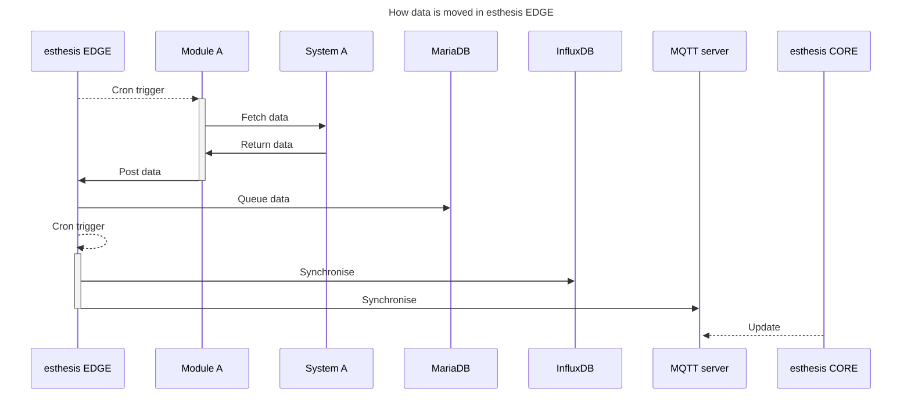

# How it works

esthesis EDGE allows you to fetch data from external systems into a local InfluxDB database, as well as to synchronise
data with [esthesis CORE](https://esthes.is/core).

The data sources of esthesis EDGE, named 'modules', allow you to have one instance of esthesis EDGE fetching data from
multiple third-party systems. Modules are developed in an incremental fashion, provided a third-party system is of a 
nature that may be of interest to other users. If you want to integrate a third-party system into esthesis EDGE, please
suggest so in our [GitHub repository](https://github.com/esthesis-iot/esthesis-edge/issues).

Fetching data from third-party system and the synchronising it is a two-step process as presented next.

## Fetching data
To fetch data from a third-party system you need to enable the module of that specific system in esthesis EDGE. Depending
on how you have installed esthesis EDGE, you must enable the appropriate module and provide its configuration 
(client secrets, tokens, keys, etc.).

Data is fetched from third-party systems at regular intervals, using a cron job. Each module has its own cron job 
expression, so you can specify the frequency of fetching data for each module separately. Once a cron job for a specific
module is triggered, the module fetches data from the third-party system and stores it in a queue table in the MariaDB 
database of esthesis EDGE. Before stored in the queue, remotely-fetched data is transformed to the esthesis Line 
Protocol (eLP) format.

## Synchronising data

Synchronising data consists of esthesis EDGE taking the data out of its local queue to post them to the local InfluxDB, 
as well as to esthesis CORE. Both targets are optional, and you can enable or disable them in the configuration of 
esthesis EDGE.

The duration for which data is kept in the local queue depends on two conditions:
1. Data that has been fully synchronised (i.e. posted to all targets you have enabled) is removed from the queue based on
a configurable retention period. The frequency of how often the retention period is checked is also configurable. This
option allows you to keep data in the queue for a certain period, in case you want to re-synchronise it or to keep it for
debugging purposes.
2. Data that has not been fully synchronised (i.e. not posted to all targets you have enabled) is kept in the queue until
a configurable time limit is reached. The frequency of how often the time limit is checked is also configurable. This
option allows you to clean up the queue from data that for one reason or another could not be synchronised, so that your
queue does not grow indefinitely.

<tip>
Make sure that there is enough storage available for the MariaDB database, as the queue can grow quickly if you have
enabled many modules with a high frequency of data fetching with high retention periods.
</tip>

## Data sync types
Once data is fetched into esthesis EDGE's local queue, it can then be synchronised with two targets: An InfluxDB database, 
and esthesis CORE. Both targets are optional, and you can enable or disable them in the configuration of esthesis EDGE.

_Note that although InfluxDB synchronisation is referred to as "local", the actual InfluxDB database can be located on 
anywhere._

### Local data sync
Local data sync allows you to store data fetched from third-party systems, queued to esthesis EDGE's MariaDB, to an
InfluxDB database. This is useful if you want to store data for a longer period, or if you want to use the data in
InfluxDB for further processing.

The frequency of synchronising data with InfluxDB is configurable. 

### esthesis CORE data sync
esthesis CORE data sync allows you to synchronise data fetched from third-party systems, queued to esthesis EDGE's MariaDB,
to esthesis CORE. This synchronisation takes place by esthesis EDGE emulating esthesis CORE devices, similar to what
esthesis CORE device agent provides. Such emulated devices appear as esthesis CORE devices, having a type of "edge", and
can be used in the same way as any other device in esthesis CORE; of course, being emulated devices, they do not provide
a pseudo-shell, nor can they reply to commands.

Note that for esthesis CORE data sync to work, you must have first allowed esthesis EDGE to register its own devices to
esthesis CORE. To do so, you must have device registration enabled on esthesis CORE. Once an esthesis EDGE device is 
registered to esthesis CORE, you can then switch device registration off in esthesis CORE, provided you do not expect
any other devices to register to esthesis CORE.

The frequency of synchronising data with esthesis CORE is configurable.
